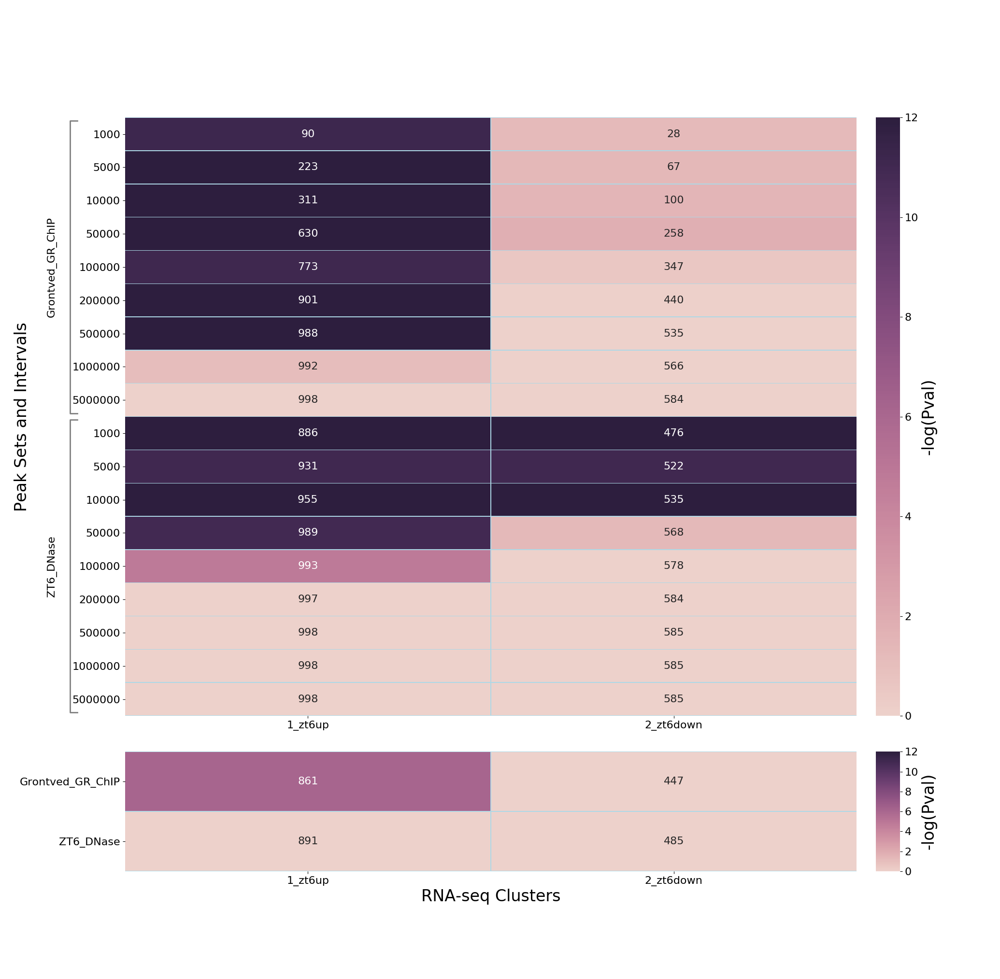

**************************************
PEGS: Peak-set Enrichment of Gene-Sets
**************************************

``PEGS`` (**P**\ eak-set **E**\ nrichment of **G**\ ene-**S**\ ets) is
a Python bioinformatics utility for calculating enrichments of gene
clusters at different genomic distances from peaks.

* Free software: 3-Clause BSD License
* Documentation: https://pegs.readthedocs.io/en/latest/
* Code: https://github.com/fls-bioinformatics-core/pegs

-----------
Quick Start
-----------

The recommended way to get started with ``PEGS`` is to download
the latest version from the "releases" page on GitHub:

https://github.com/fls-bioinformatics-core/pegs/releases

and create a Python virtual environment, to install the software
into using the ``pip`` utility.

For example: to create and activate a virtual environment called
``venv.pegs`` using the ``virtualenv`` utility:

::

    virtualenv venv.pegs
    source venv.pegs/bin/activate

The ``PEGS`` package can then be installed using ``pip``, for
example:

::

    pip install pegs-0.4.0.tgz

The simplest use of the program is:

::

    pegs GENE_INTERVALS PEAKS_DIR CLUSTERS_DIR

where ``GENE_INTERVALS`` is a set of reference transcription
start sites (TSSs) for all genes, ``PEAKS_DIR`` is a directory
containing BED files with peak-sets, and ``CLUSTERS_DIR`` is a
directory containing files defining gene clusters.

This will output a PNG heatmap and an XLXS file with the
p-values and gene counts from the enrichment calculations.

Full documentation can be found at:

 * https://pegs.readthedocs.io/en/latest/

---------
Licensing
---------

PEGS is licensed under the 3-Clause BSD License.

---------------------------------------
Example: Mouse glucocorticoidal dataset
---------------------------------------

An example application of ``PEGS`` is the analysis of up- and
down-regulated glucocorticoidal targets from an RNA-seq study
of liver samples from mice treated acutely with dexamethasone
or vehicle (Caratti *et al.* 2018), combined with corresponding
GR ChIP-seq and chromatin accessibility data (DNase I
hypersensitive (DHS) regions) (Grontved *et al.* 2013 and
Sobel *et al.* 2017 respectively), and mouse liver TAD
boundary data (Kim *et al.* 2018).

The files for these datasets are available here:

 * RNA-seq data:
   `1_zt6up.txt <examples/glucocorticoid_example/data/clusters/1_zt6up.txt>`_
   and `2_zt6down.txt <examples/glucocorticoid_example/data/clusters/2_zt6down.txt>`_
 * ChIP-seq and chromatin accessibility data:
   `Grontved_GR_ChIP.bed <examples/glucocorticoid_example/data/peaks/Grontved_GR_ChIP.bed>`_
   and
   `ZT6_DNase.bed <examples/glucocorticoid_example/data/peaks/ZT6_DNase.bed>`_
 * TAD boundary data:
   `mESC-TADs_mm10.txt <examples/glucocorticoid_example/data/mESC-TADs_mm10.txt>`_

The ``PEGS`` analysis was performed on these data using the
command::

    pegs mm10 \
      data/peaks/ data/clusters/ \
      -t data/mESC-TADs_mm10.txt \
      1000 5000 10000 50000 100000 200000 500000 1000000 5000000

The resulting output files (XLSX and heatmap) can be found here:

 * `glucocorticoid_heatmap.png <examples/glucocorticoid_example/results/glucocorticoid_heatmap.png>`_
 * `glucocorticoid_results.xlsx <examples/glucocorticoid_example/results/glucocorticoid_results.xlsx>`_

The analyses indicate a strong association of dexamethasone
up-regulated genes with dexamethasone-induced GR peaks at
distances up to 500kbp from these peaks, but no evidence of
down-regulated genes - indicating distinct mechanisms of gene
activation and repression by glucocorticoids. At the same time,
there is promoter proximal enrichment for both up-and
down-regulated genes in the DHSs.

**Acknowledgement**

Thanks to Louise Hunter for providing this example.

**References**

* Caratti, G. *et al.* (2018) REVERBa couples the clock to hepatic
  glucocorticoid action. *J Clin Invest* **128(10)**:4454-4471
* Grontved, L. *et al.* (2013) C/EBP maintains chromatin accessibility
  in liver and facilitates glucocorticoid receptor recruitment to
  steroid response elements. *EMBO J* **32(11)**, 1568-83
* Kim, Y.H. *et al.* (2018) Rev-erbα dynamically modulates chromatin
  looping to control circadian gene transcription. *Science*
  **359(6381)**:1274-1277
* Sobel, J.A. *et al.* (2017) Transcriptional regulatory logic of the
  diurnal cycle in the mouse liver. *PLoS Biol* **15(4)**: e2001069
