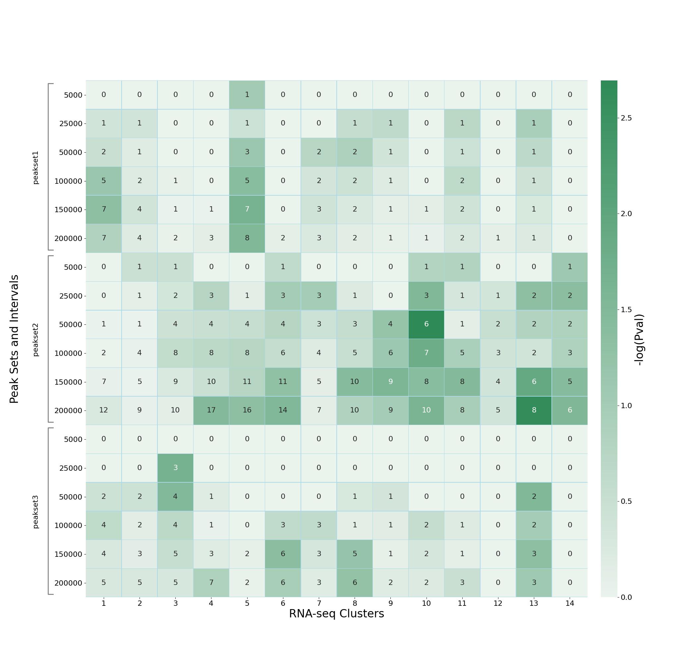
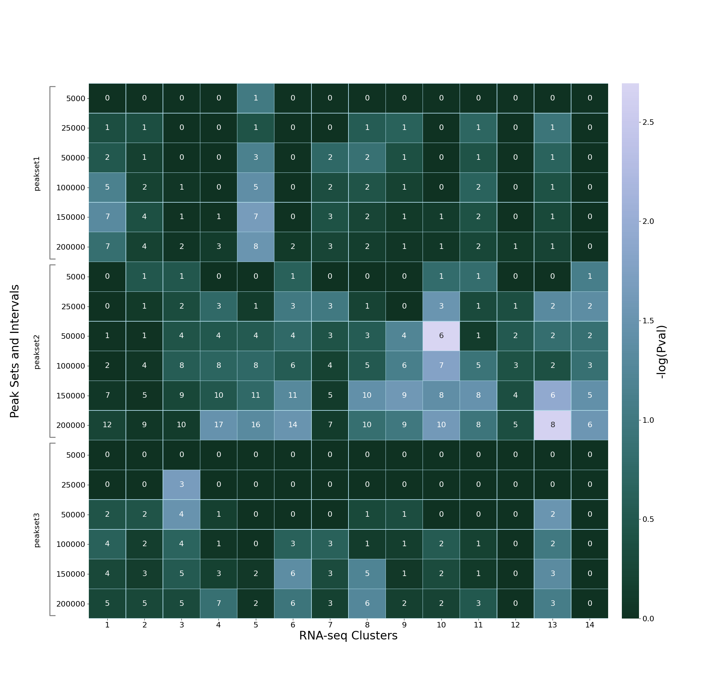

**************
Advanced usage
**************

.. _making_gene_interval_files:

Making gene interval files
==========================

In order to work with other builds of human and mouse genome, or with
other organisms, the ``mk_pegs_intervals`` utility should be used to
generate a reference gene interval data file for input into the ``PEGS``
analysis:

::

    mk_pegs_intervals REFGENE_FILE

where:

 * ``REFGENE_FILE`` is the refGene annotation data for the genome
   of interest. These annotations can be obtained from UCSC table
   browser.

By default the output gene interval file will be called
``<REFGENE_FILE>_intervals.bed``; you can explicitly specify the
name using the ``-o`` option:

::

    mk_pegs_intervals refGene_mm10.txt -o refGene_mm10_120719_intervals.bed

.. _customising_the_heatmap:

Customising the heatmap
=======================

Specifying the heatmap image format (PNG, SVG, PDF etc)
-------------------------------------------------------

By default the heatmap is output from ``PEGS`` in PNG format, however
it is possible to change this in one of two ways, either:

* Use the ``--format`` option to explicitly specify the format
  as ``png``, ``svg``, ``pdf`` etc, or
* Use the ``-m`` option to explicitly specify the name for the
  output heatmap and use the appropriate file extension for the
  image format that you want (for example ``my_heatmap.svg``
  will automatically generate the heatmap as an SVG image).

Setting the heatmap axis labels
-------------------------------

The default axis labels in the heatmap can be changed using the
``--x-label`` and ``--y-label`` options, which specify the label
for the gene clusters (X-axis) and for the peak sets/distances
(Y-axis).

For example:

::

   --x-label "Gene clusters" --y-label "Peaks and distances"

Changing the heatmap colours
----------------------------

The heatmap colour palette is the default Seaborn ``cubehelix`` palette
as generated by the ``seaborn.cubehelix_palette`` function:

 * https://seaborn.pydata.org/generated/seaborn.cubehelix_palette.html

A custom palette can be specified by using the ``--color`` option
to supply a base colour, for example:

::

    --color seagreen

which produces a heatmap of the form:

Alternatively the palette can be fully specified by setting the
parameters supplied to ``seaborn.cubehelix_palette``, by using the
``--heatmap-palette`` option. For example, specifying:

::

    --heatmap-palette start=2 reverse=True

results in a "blue/green" heatmap (``start=2``)  with low values
rendered as darker and high values as lighter (``reverse=True``):

Some other examples can be found at
https://seaborn.pydata.org/tutorial/color_palettes.html#sequential-cubehelix-palettes
