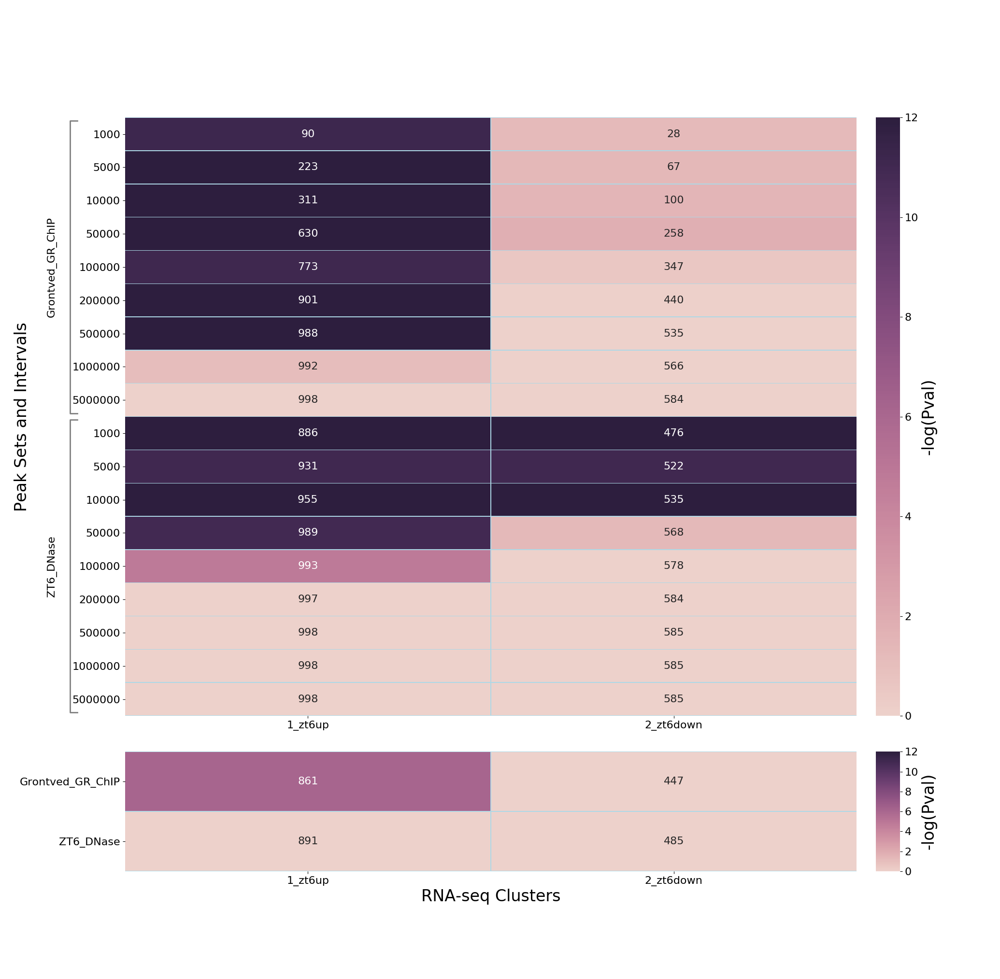

********
Examples
********

The following examples ``PEGS`` used in different analyses:

 * :ref:`Mouse glucocorticoidal example`

.. _Mouse glucocorticoidal example:
   
Mouse glucocorticoidal dataset
==============================

**Thanks to Louise Hunter for providing this example.**

.. note::
   
   The input files and the resulting outputs can be obtained by
   downloading and unpacking the ``tar.gz`` archive at
   :download:`glucocorticoid_example.tar.gz <examples/glucocorticoid_example.tar.gz>`

Background
----------

An example application of ``PEGS`` is the analysis of up- and
down-regulated glucocorticoidal targets from an RNA-seq study
of liver samples from mice treated acutely with dexamethasone
or vehicle (Caratti *et al.* 2018), combined with corresponding
GR ChIP-seq and chromatin accessibility data (DNase I
hypersensitive (DHS) regions) (Grontved *et al.* 2013 and
Sobel *et al.* 2017 respectively), and mouse liver TAD
boundary data (Kim *et al.* 2018).

The files for these datasets are:

 * RNA-seq data:
   ``1_zt6up.txt`` and ``2_zt6down.txt`` (placed in a ``clusters``
   dirctory)
 * ChIP-seq and chromatin accessibility data:
   ``Grontved_GR_ChIP.bed`` and ``ZT6_DNase.bed`` (placed in a
   ``peaks`` directory)
 * TAD boundary data:
   ``mESC-TADs_mm10.txt``

PEGS analysis
-------------

``PEGS`` can be run on these data using the command::

    pegs mm10 \
      --peaks data/peaks/*.bed --genes data/clusters/*.txt \
      -d 1000 5000 10000 50000 100000 200000 500000 1000000 5000000 \
      --tads data/mESC-TADs_mm10.txt \
      --name glucocorticoid \
      -o results/

This outputs a PNG heatmap
:download:`glucocorticoid_heatmap.png <examples/glucocorticoid_heatmap.png>`:

along with an XLSX file that contains the raw data
:download:`glucocorticoid_results.xlsx <examples/glucocorticoid_results.xlsx>`.

Conclusions
-----------
	  
The analyses indicate a strong association of dexamethasone
up-regulated genes with dexamethasone-induced GR peaks at
distances up to 500kbp from these peaks, but no evidence of
down-regulated genes - indicating distinct mechanisms of gene
activation and repression by glucocorticoids. At the same time,
there is promoter proximal enrichment for both up-and
down-regulated genes in the DHSs.

References
----------

* Caratti, G. *et al.* (2018) REVERBa couples the clock to hepatic
  glucocorticoid action. *J Clin Invest* **128(10)**:4454-4471
* Grontved, L. *et al.* (2013) C/EBP maintains chromatin accessibility
  in liver and facilitates glucocorticoid receptor recruitment to
  steroid response elements. *EMBO J* **32(11)**, 1568-83
* Kim, Y.H. *et al.* (2018) Rev-erbα dynamically modulates chromatin
  looping to control circadian gene transcription. *Science*
  **359(6381)**:1274-1277
* Sobel, J.A. *et al.* (2017) Transcriptional regulatory logic of the
  diurnal cycle in the mouse liver. *PLoS Biol* **15(4)**: e2001069
