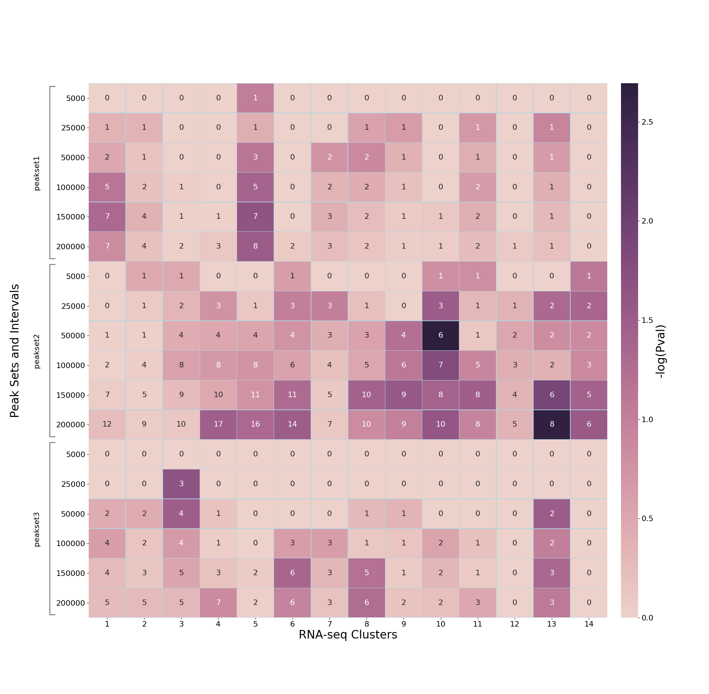

************
Output files
************

Overview
========

The default output of the program is a heatmap and the
corresponding data as an XLSX spreadsheet.

Heatmap
=======

In the heatmap, x-axis are the gene clusters, and y-axis show
peak-sets expanded to different genomic distances.

The cell color represents -log10(p-value) of enrichment, and
annotation of cells are the number of common genes for that
particular combination of gene cluster (x-axis) and gene-set
derived from the expanded peak-set (y-axis). For example:

If TADs are used, then the additional subplot at the bottom shows
similar enrichment as above, but without individual distances
for peak-sets (because each genomic interval is expanded to
distance/bounary defined in the TADs BED file). For example:

By default the heatmap is output as a PNG image, however this
can be changed (along with other properties of the heatmap such
as colours and axis labels) as described in
:ref:`customising_the_heatmap`.

XLSX file
=========

This spreadsheet includes all the data (including p-values, and
common genes) used to generate the heatmap; for example:

Note that as all the data used in the heatmap is also output to
the XLSX file, the user can use this to build their own custom
heatmaps.

Optional outputs
================

Intersection files
------------------

By default the program removes all working data on successful
completion, however it is possible to keep the intermediate
intersection files by specifying the ``-k``
(``--keep-intersection-files``) option. The intersection files
will be written to the directory ``intersection_beds``.

These files are generated by intersecting the expanded peak-set
BED file (for a given distance) and the ``GENE_INTERVALS`` input
file (reference gene intervals file for all genes). They can be
used for further analysis, for example finding common gene names
and overlapping peaks, which can be used for motif enrichment etc.

Raw p-value and count data
--------------------------

These can be output using the ``--dump-raw-data`` option.
